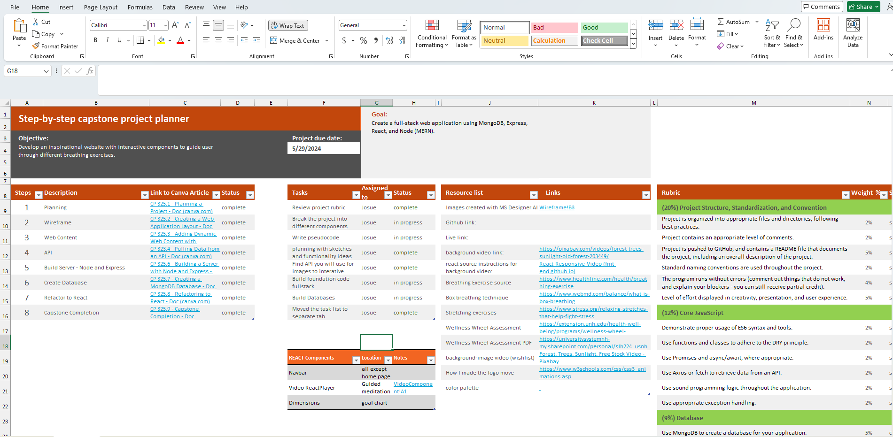

# Capstone Project

The objective of this project was to build a full stack application using MongoDB, Express, React, and Node, MERNstack for short. We were given creative liberty for everything else. I chose to create an application based on wellness. This application focuses on a couple of aspects of wellness. It goes over breathing techniques, meditation, and wellness goals to plan out your journey to a better you. 

## Planning Stage

I decided to plan with tools I was most familiar with: Microsoft Excel! 

## Wireframing

I _sketched out_ a wireframe of what I wanted the application to look like, and I did a pretty good job of translating that onto HTML,CSS, and Javascript. 

## Learning Takeaways

- Number one thing I had a lot of practice on was **debugging!**. Shout out to Bryan, who always demoed on the Dev Tools in office hours.
- Second thing I got practice on was CSS. Keyframes, the scale property, the box-shadow property, flexbox shananigans, and variables.
- Having daily _stand-up sessions_ with the instructors and my classmates on Discord over the weekend helped keep me accountable, and the feedback was key to developing the goals tracker! Also, their feedback made me realize that I should be proud of myself. I've come a long way since the beginning of this course. **I _am_ proud of myself!**

## Difficulties/Setbacks 

- I wish I would have read the capstone documents on day one. 7 days was not enough time to complete. I had talked about wanting to do my project on wellness and cats (logo). Having the project in mind since the beginning would have saved much frustration. I was not finished with some features: 
    - The entire breathing page is incomplete. Although, I created the collection of MongoDB for 4 breating techniques, the Goal page took up much of my time to refactor into React. Things didn't translate easily in the CSS styling department. 

## In the Future 

1. I wanted to have more guided meditation videos. Oksana Esberard was my wellness coach from 2020-2024, and she had a 5-day guided meditation series that I wanted to have a carousel using the swiper npm. I plan on workign on that in the near future. I do want to show her the website once I have added those features, and learn how to host my personal websites publicly. 
2. I wasn't up for the idea of a login, but I did want the website to have the user enter their name and have the website address the user by name in th instructions. That is a wish list item that I will consider. 
3. I also wanted to include stretching techniques. It will take on the same components and style as the breathing techniques and should not take much to include. 

## Planner Included

I've included a copy of my excel spreadsheet used for the planning stage in the Readme-Assets folder. In there I have links to many of the resources used for the color palette, breathing techniques, stretching techniques, and websites I used for consulting.
